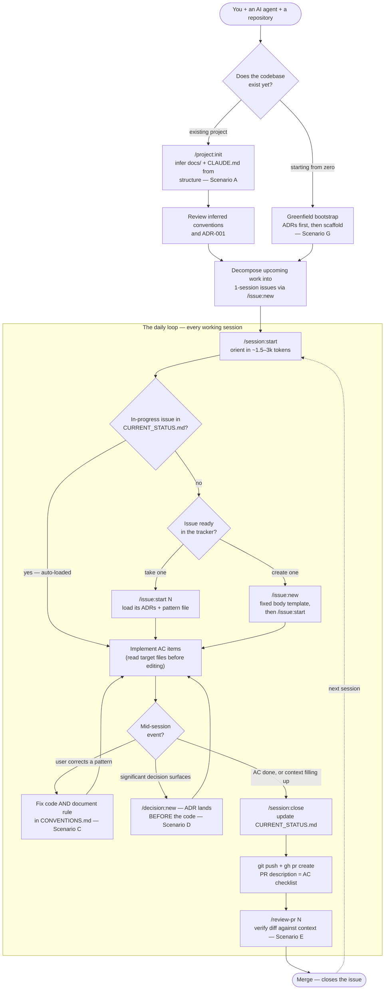
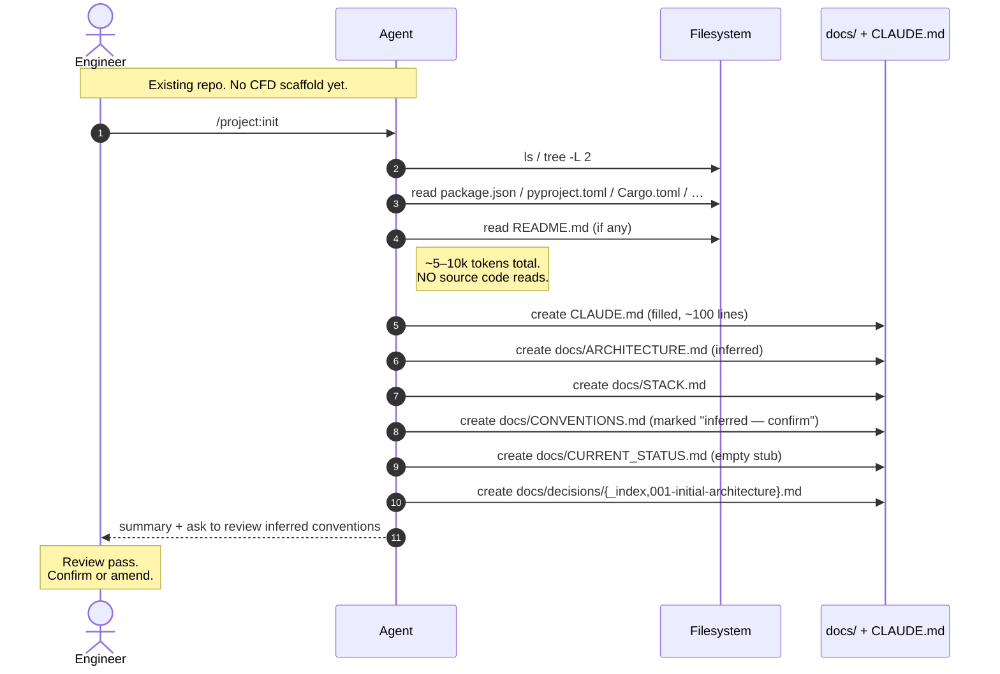
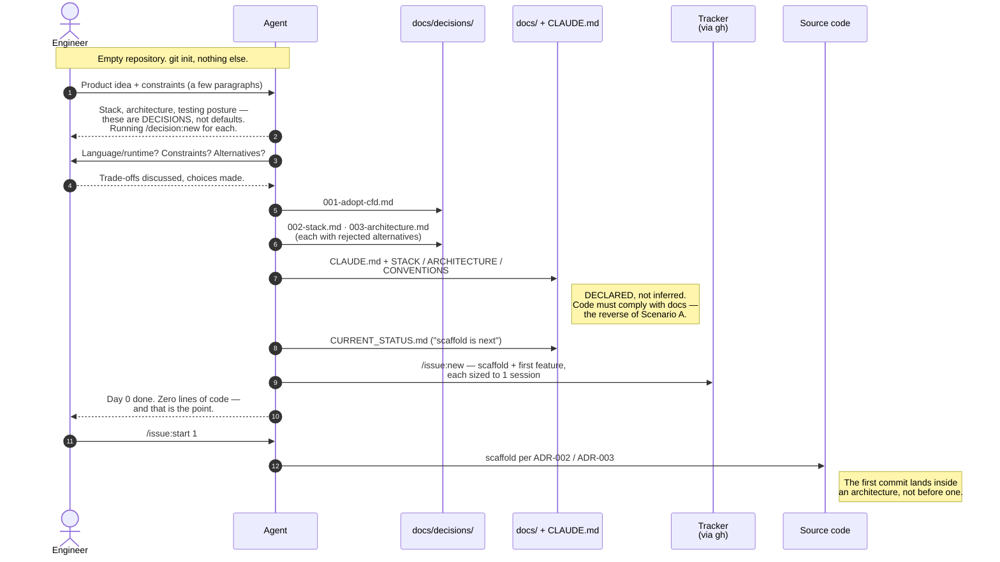
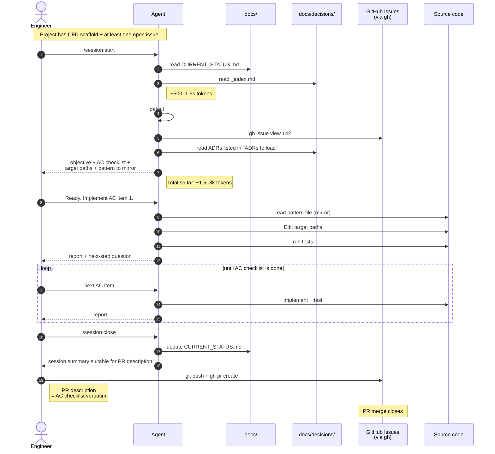
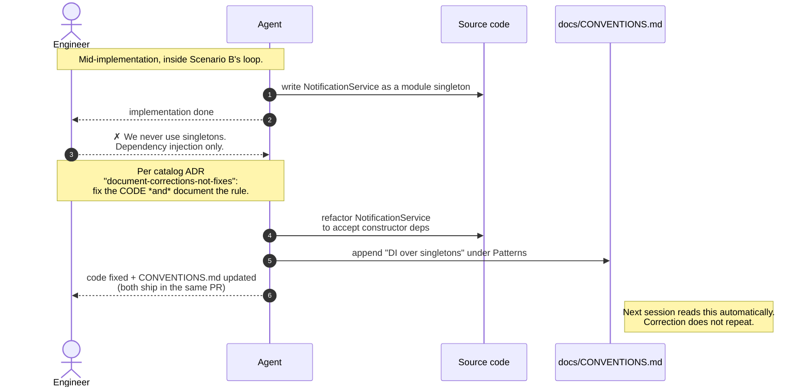
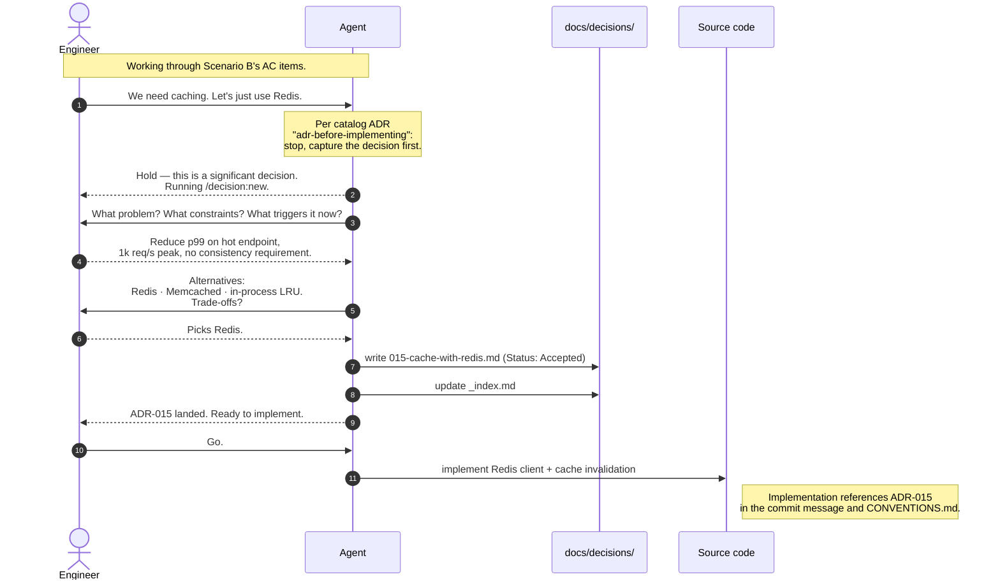
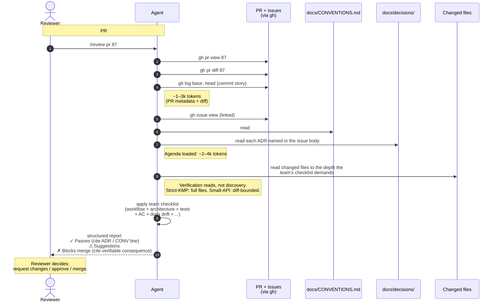

# CFD in motion

A map of the whole workflow, then six sequence diagrams showing what a
CFD session actually looks like, message by message. Start with the
map, pick your entry point (A for an existing codebase, G for a
greenfield repo), then read B → C → D → E in order.

> **Notation.** Diagrams are [Mermaid](https://mermaid.js.org/) and
> render natively on GitHub. Token-cost annotations are approximate
> and based on the [methodology essay](../METHODOLOGY.md).

## The map — entry points and the daily loop

Two ways in, one loop forever after. Adopting on an existing project
(Scenario A) infers the docs from the code; starting from zero
(Scenario G) declares the docs before the code. Either way you land in
the same daily loop: orient, take or create an issue, implement,
close, review.

Three properties make the loop cheap: orientation is O(1k) tokens
because state lives in `CURRENT_STATUS.md` and the tracker, not in
chat history; every issue is 1-session-sized by construction
(`/issue:new` forces decomposition); and sessions are disposable —
closing early costs one `/session:start`, drifting costs redone work
(see the
[short-sessions](../adrs/ai-workflow/short-sessions-over-long.md)
catalog ADR).

## Scenario A — Bootstrap: adopting CFD on an existing project

**When:** Day 0. You have a real repo with 100+ files, no `CLAUDE.md`,
no `docs/`. You run `/project:init` once.

**Key property:** the agent does NOT scan source code. It infers from
the directory layout and dependency files. Source code reading is
deferred until real work surfaces it.

After this scenario you have CFD scaffold. Real work uses Scenario B.

---

## Scenario G — Greenfield: starting from zero

**When:** Day 0 of a project that does not exist yet. `git init` and
nothing else — no code, no docs, no decisions made.

**Key property:** the mirror image of Scenario A. There, docs are
**inferred** from existing code and marked "confirm"; here, docs are
**declared** before any code exists and are prescriptive — the first
commit already has an architecture it must comply with. Stack and
architecture choices are captured as ADRs *at the moment they are
made*, when the alternatives are still fresh, instead of being
reverse-engineered later.

This is not hypothetical: in the [sii case study](../case-studies/sii.md),
ADR-001 ("Adopt CFD") carries the same date as the repository's
creation.

From here on, every session is Scenario B.

---

## Scenario B — Canonical session (happy path)

**When:** every working session, once CFD is established. The vast
majority of sessions look like this.

**Key property:** session-start consumes ~1.5–3k tokens to fully
orient — including the auto-loaded in-progress issue. Source code is
read only once a focus is chosen.

---

## Scenario C — Correction surfaces a new convention

**When:** the agent generates code that violates an unstated team
convention. You don't just fix the code — you document the convention.

**Key property:** the convention is captured in
`docs/CONVENTIONS.md` in the **same change** as the code fix. Next
session, the model reads the convention automatically. The same
correction never repeats.

This is the
[`document-corrections-not-fixes`](../adrs/process/document-corrections-not-fixes.md)
catalog ADR in action.

---

## Scenario D — Mid-session decision triggers `/decision:new`

**When:** during implementation, a non-trivial decision surfaces (a
new dependency, a new pattern, a new strategy). Instead of just doing
it, the agent stops and writes the ADR first.

**Key property:** the ADR lands BEFORE the code that implements it.
Future sessions can reconstruct *why* without git archaeology, and the
rejected alternatives are preserved so the model does not later
suggest reverting.

This is the
[`adr-before-implementing`](../adrs/ai-workflow/adr-before-implementing.md)
catalog ADR in action.

---

## Scenario E — PR review against context (closing the cycle)

**When:** the session opened a PR. Before merge, the diff is reviewed
against the project's context — NOT by reading the changed files in
full, but by **cross-checking the diff against indices** (CONVENTIONS,
ADRs, the linked issue's AC, the PR template).

**Key property:** the operational thesis of CFD made literal. The
review's *agenda* is set by the indices (CONVENTIONS + ADRs + AC +
PR template + the team's curated checklist). The depth of file reads
is whatever that agenda demands — minimal for a small Node API,
exhaustive for a strict KMP project. The work is **verification
against known rules**, not **discovery of intent from code**.

This is the
[`pr-review-against-context`](../adrs/process/pr-review-against-context.md)
catalog ADR in action.

---

## How to use these diagrams

- **You're learning CFD.** Start with the map, then read A (or G) →
  B → C → D → E. By the end you've seen every flow the methodology
  actually runs.
- **You're adopting CFD on an existing repo.** A is your day 0. B is
  the loop you run from day 1 onward. C and D are the
  failure-recovery patterns that keep the methodology honest. E is
  how the loop closes before merge.
- **You're starting a project from zero.** G is your day 0 —
  decisions and docs land before the first line of code, so the
  scaffold is born compliant. Then B, same as everyone else.
- **You're presenting CFD to your team.** The map is the opening
  slide. B is the headline. A and G are the "how do I start?"
  answers. C and D are the slides that explain why CFD is more than
  "another file format". E is the slide that shows the token economy
  of the whole approach — *diff, not repo*.

## See also

- [`adrs/_index.md`](../adrs/_index.md) — the shareable ADR catalog.
- [`templates/`](../templates/) — the slash commands referenced above.
- [`case-studies/sii.md`](../case-studies/sii.md) — a real
  project running these flows.
- [`METHODOLOGY.md`](../METHODOLOGY.md) — the canonical essay.
