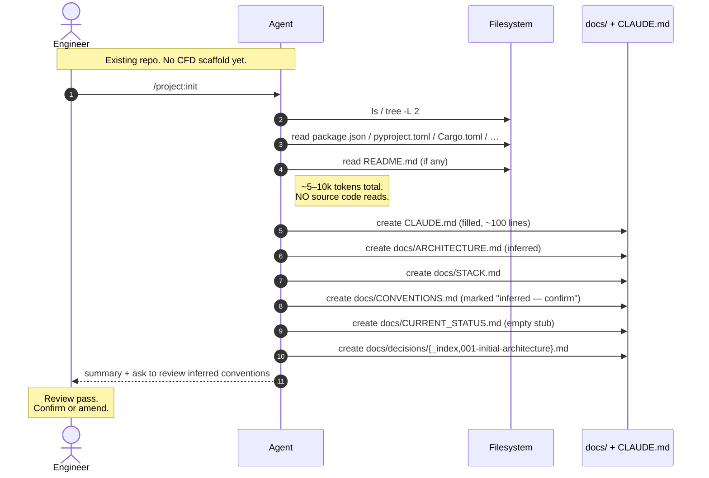
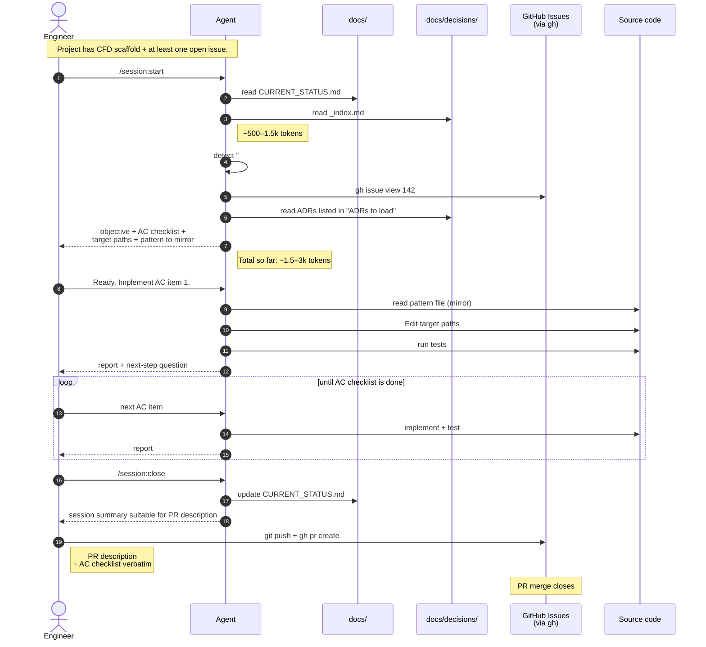
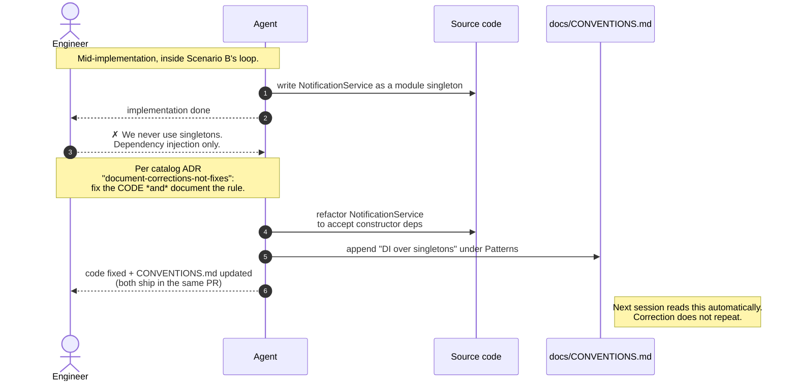
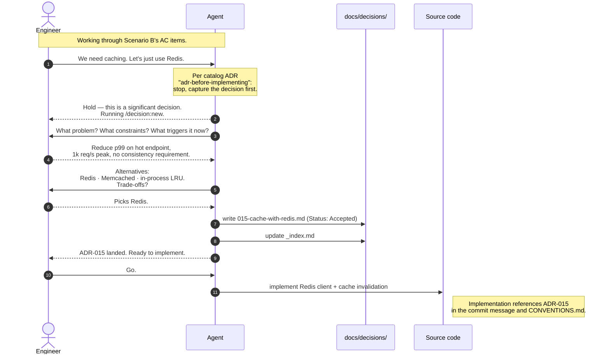

# CFD in motion

Four sequence diagrams showing what a CFD session actually looks like,
message by message. Read in order; each scenario builds on the previous.

> **Notation.** All diagrams are [Mermaid sequence
> diagrams](https://mermaid.js.org/syntax/sequenceDiagram.html) and
> render natively on GitHub. Token-cost annotations are approximate
> and based on the [methodology gist](../METHODOLOGY.md).

## Scenario A — Bootstrap: adopting CFD on an existing project

**When:** Day 0. You have a real repo with 100+ files, no `CLAUDE.md`,
no `docs/`. You run `/project:init` once.

**Key property:** the agent does NOT scan source code. It infers from
the directory layout and dependency files. Source code reading is
deferred until real work surfaces it.

After this scenario you have CFD scaffold. Real work uses Scenario B.

---

## Scenario B — Canonical session (happy path)

**When:** every working session, once CFD is established. The vast
majority of sessions look like this.

**Key property:** session-start consumes ~1.5–3k tokens to fully
orient — including the auto-loaded in-progress issue. Source code is
read only once a focus is chosen.

---

## Scenario C — Correction surfaces a new convention

**When:** the agent generates code that violates an unstated team
convention. You don't just fix the code — you document the convention.

**Key property:** the convention is captured in
`docs/CONVENTIONS.md` in the **same change** as the code fix. Next
session, the model reads the convention automatically. The same
correction never repeats.

This is the
[`document-corrections-not-fixes`](../adrs/process/document-corrections-not-fixes.md)
catalog ADR in action.

---

## Scenario D — Mid-session decision triggers `/decision:new`

**When:** during implementation, a non-trivial decision surfaces (a
new dependency, a new pattern, a new strategy). Instead of just doing
it, the agent stops and writes the ADR first.

**Key property:** the ADR lands BEFORE the code that implements it.
Future sessions can reconstruct *why* without git archaeology, and the
rejected alternatives are preserved so the model does not later
suggest reverting.

This is the
[`adr-before-implementing`](../adrs/ai-workflow/adr-before-implementing.md)
catalog ADR in action.

---

## How to use these diagrams

- **You're learning CFD.** Read A → B → C → D in order. By the end
  you've seen every flow the methodology actually runs.
- **You're adopting CFD.** A is your day 0. B is the loop you run from
  day 1 onward. C and D are the failure-recovery patterns that keep
  the methodology honest.
- **You're presenting CFD to your team.** B is the headline. A is the
  "how do I start?" answer. C and D are the slides that explain why
  CFD is more than "another file format" — they show the discipline.

## See also

- [`adrs/_index.md`](../adrs/_index.md) — the shareable ADR catalog.
- [`templates/`](../templates/) — the slash commands referenced above.
- [`case-studies/nemo-cli.md`](../case-studies/nemo-cli.md) — a real
  project running these flows.
- [`examples/node-express/`](../examples/node-express/) — runnable
  code with the same flows applied.
- [`METHODOLOGY.md`](../METHODOLOGY.md) — the canonical essay.
